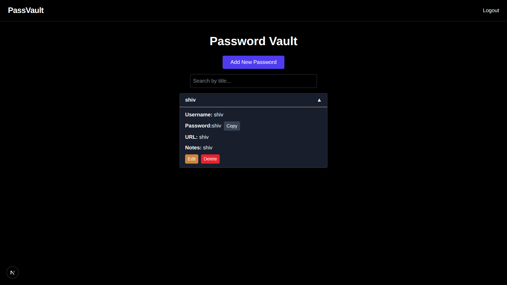

# Password Vault & Generator (MVP)

A **fast, privacy-first password manager** web app built with Next.js and MongoDB.
Users can **generate strong passwords**, store them securely in a personal vault, and **view, edit, or delete** entries—all while keeping sensitive data encrypted on the client side.

---

## 🛠 Tech Stack

* **Frontend:** Next.js + TypeScript + Tailwind CSS
* **Backend:** Next.js API Routes (Node.js)
* **Database:** MongoDB
* **State Management:** Zustand
* **Encryption:** `crypto-js` (AES) for client-side encryption of vault items
* **Authentication:** Email + Password with JWT (access & refresh tokens)

---

## ⚡ Features

* **Password Generator**

  * Adjustable length slider
  * Include/exclude letters, numbers, symbols
  * Avoid look-alike characters
* **Secure Vault**

  * Add, edit, delete vault items
  * Fields: Title, Username, Password, URL, Notes
  * Client-side encryption (AES)
* **Clipboard**

  * Copy passwords with auto-clear after 20 seconds
* **Authentication**

  * Sign up, Sign in, Refresh tokens
* **Search & Filter**

  * Quickly search vault items by title or username


---

## 🔐 Encryption

* **Library:** `crypto-js` AES
* **Reason:** All vault data is encrypted client-side before sending to the server. The server **never stores plaintext passwords**, ensuring maximum privacy.
* **Flow:**

  1. User enters vault data → encrypted in browser → sent to API → stored in MongoDB
  2. Data is decrypted only on the client when displayed

---

## 🚀 Getting Started

### Prerequisites

* Node.js v18+
* MongoDB instance (local or cloud)

### Install dependencies

```bash
git clone git@github.com:shivendra-dev54/password-vault-mvp.git
cd password-vault-mvp
npm install
```

### Setup environment variables

Create a `.env.local` file in the root:

```env
MONGO_URI=<your_mongo_connection_string>
ACCESS_TOKEN_SECRET=<random_secret_key>
REFRESH_TOKEN_SECRET=<random_secret_key>
NEXT_PUBLIC_API_BASE_URL=<base_url_of_api(same as app)>
NODE_ENV=production
```

### Run the app

```bash
npm run dev
```

Open [http://localhost:3000](http://localhost:3000) to see the app.

---

## 🖥 Screenshots / Demo

* Landing page / auth
* Password vault dashboard (collapsed view with expandable items)
* Add / edit modal
* Delete confirmation modal
* Password generator slider




---

## ✅ How to Use

1. **Sign up** with your email and password
2. **Sign in** to access your vault
3. **Add a new password** via the Add button (password can be generated automatically)
4. **Click on a title** to expand the item and see details
5. **Edit or delete** entries using the buttons
6. **Copy password** safely with auto-clear

---

## 📂 Deployment

* Can be deployed on **Vercel** (for Next.js frontend + backend)
* MongoDB can be hosted on **MongoDB Atlas** (free tier)
* No secrets stored in logs; all vault items encrypted

---

## 👨‍💻 Author

**Shivendra**
